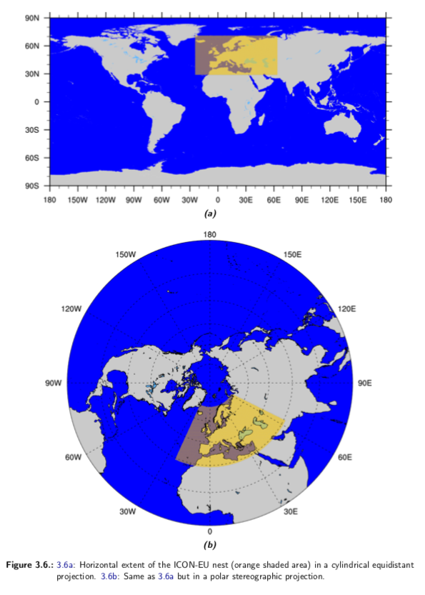
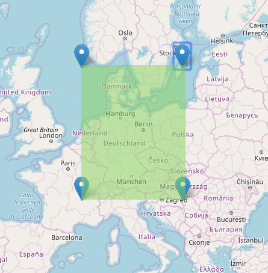

# DWDWeatherTools
Java command line client to download and convert weather data of the
[ICON-EU](https://www.dwd.de/DE/leistungen/modellvorhersagedaten/modellvorhersagedaten.html)
model from the Deutscher Wetterdienst ([DWD](https://www.dwd.de/EN/Home/home_node.html)),
the federal meteorological service in Germany.

These tools are work in progress and although they are used in our institute to collect
data from the DWD they might contain bugs. If find one, please consider handing in an issue.

## Table of Contents

- [Background Information](#background-information)
- [Features](#features)
- [Processed Data](#processed-data)
- [Requirements](#requirements)
- [Usage](#usage)

### Background Information
The DWD provides a free weather forecast on their server using the ICON model.
The forecast consists of different forecast variables and parameters which may
have one or more height levels.

Every 3 hours the DWD starts a calculation for each parameter for the next
12-76 hours (depending on the parameter). Afterwards the model run results are uploaded,
which may take up to 5 hours after the start, but most times takes about 2-3 hours.
The results are structured into GRIB2 (.grib2) files, one per calculated hour and parameter,
that are compressed as .bz2-archives. The data normally is overwritten everytime new model run
data is uploaded. To keep data permanently e.g. for research purposes, one has to store them
locally and run the downloader recurring e.g by using a cron job every 3 hours.
The path to each result is built logically:

`https://opendata.dwd.de/weather/nwp/icon-eu/grib/<modelrun in HH-format>/<parameter_name>/icon-eu_europe_regular-lat-lon_[model/single]-level_<modelrun-date in YYYYMMDDHH-format>_<timestep in HHH-format>_<[height level in two-digit-format_]><parameter_name>.grib2.bz2`

### Features
-   Downloader to collect the temporarily available ICON weather data from the
	DWD OpenData servers
-   Converter to extract the weather data from the downloaded files and persist
	them into a PostgreSQL database

### Processed Data

#### Parameter
While in general the downloaded raw data might contain all values described in the model
[documentation](https://isabel.dwd.de/DWD/forschung/nwv/fepub/icon_database_main.pdf),
in our case we only need some specific variables and parameters, which are extracted
during the conversion process. If you require additional parameters you might consider
adapting the downloader and converter accordingly or hand in an issue.

At the moment, the following parameters are converted:

// todo parameters

#### Grid Information
The currently covered area by the DWD Icon model consists of the coordinates shown below.
This whole area is covered by the downloader as well as all parameters are downloaded for
the whole area.

|                   | ICON-EU nest                          |
|-------------------|---------------------------------------|
|geogr. coordinates | 23.5° W – 62.5° E / 29.5° N – 70.5° N |
|mesh size          | ≈ 6.5 km (R3B08) / 659156 triangles   |
|vertical levels	| 60 level                              |
|upper boundary	    | 22.5km                                |

In contrast, the converter area can be set in the code to the area of interest.
Hence, as long as the raw icon data is available, it can always be filtered and
converted into a specific area of interested. The current conversion area is set
to the following coordinates.

minLongitude = 4.29694 \
maxLongitude = 18.98635 \
minLatitude = 45.71457 \
maxLatitude = 57.65129

In the future it would make sense to provide the
coordinates via a config file instead of hard-coding them into the binary.
If you want to provide this future feel free to hand in an issue or a pull request.

### Requirements
* Unix based OS
* [ecCodes](https://confluence.ecmwf.int//display/ECC/Releases) installed
* JRE 17 installed
* access to a postgresql database
* internet access
* write permission on download directory
* full privileges to the .jar file of the tools
